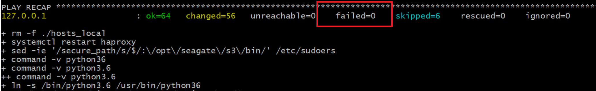
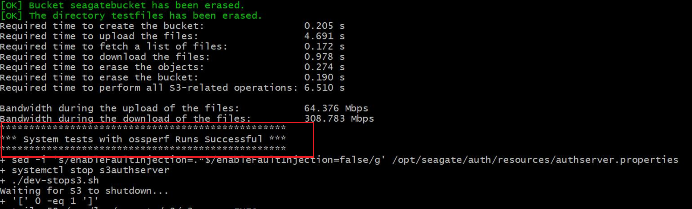

# CORTX-S3 Server Quick Start Guide
This guide provides a step-by-step walkthrough for getting you CORTX-S3 Server ready.

- [1.0 Prerequisites](#10-Prerequisites)
- [1.1 Clone the CORTX-S3 Server Repository](#11-Clone-the-CORTX-S3-Server-Repository)
- [1.2 Installing dependencies](#12-Installing-Dependencies)
- [1.3 Code Compilation and Unit Test](#13-Code-Compilation-and-Unit-Test)
- [1.4 Test your Build using S3-CLI](#14-Test-your-Build-using-S3-CLI)
- [1.5 Test a specific MOTR Version using CORX-S3 Server](#15-Test-a-Specific-MOTR-Version-using-CORX-S3-Server)
- [1.6 Build S3 RPMs](#16-Build-S3-RPMs)

### 1.0 Prerequisites

<details>
<summary>Click to expand!</summary>
<p>

1. You'll need to set up SSC, Cloud VM, or a local VM on VMWare Fusion or Oracle VirtualBox.
2. As a CORTX contributor you will need to refer, clone, contribute, and commit changes via the GitHub server. You can access the latest code via [Github](https://github.com/Seagate/cortx).
3. You'll need a valid GitHub Account.
4. Before you clone your Git repository, you'll need to create the following:
    1. Follow the link to generate the [SSH Public Key](https://git-scm.com/book/en/v2/Git-on-the-Server-Generating-Your-SSH-Public-Key).
    2. Add the newly created SSH Public Key to [Github](https://github.com/settings/keys).
    3. When you clone your Github repository, you'll be prompted to enter your GitHub Username and Password. Refer to the article to [Generate Personal Access Token or PAT](https://docs.github.com/en/github/authenticating-to-github/creating-a-personal-access-token).
    4. Copy your newly generated [PAT](https://github.com/settings/tokens) and enter it when prompted.

       :page_with_curl: **Note:** From this point onwards, you'll need to execute all steps logged in as a **Root User**.

5. We've assumed that `git` is preinstalled. If not then follow these steps to install [Git](https://git-scm.com/book/en/v2/Getting-Started-Installing-Git).
   * To check your Git Version, use the command: `$ git --version`

     :page_with_curl:**Note:** We recommended that you install Git Version 2.x.x.

6. Ensure that you've installed the following packages on your VM instance:

    * Python Version 3.0
      * To check whether Python is installed on your VM, use one of the following commands: `--version`  , `-V` , or `-VV`
      * To install Python version 3.0, use: `$ yum install -y python3`
    * pip:
      * To check if pip is installed, use: `$ pip --version`
      * To install pip use: `$ yum install python-pip`
    * Ansible: `$ yum install -y ansible`
    * Extra Packages for Enterprise Linux:
        * To check if epel is installed, use: `$ yum repolist`
            * If epel was installed, you'll see it in the output list.
            * You might also see exclamation mark in front of the repositories id. Refer to the [Redhat Knowledge Base](https://access.redhat.com/solutions/2267871).
        * `$ yum install -y epel-release`
    * Verify if kernel version is 3.10.0-1062 (for centos-7.7) or 3.10.0-1127 (for centos-7.8), using: `$ uname -r`

7. You'll need to disable selinux and firewall. Run the following commands:

     `$ systemctl stop firewalld` 

     `$ systemctl disable firewalld` 

     `$ sestatus` - you'll get a `SELinux status: disabled` status.

     `$ setenforce 0` - you'll get a `setenforce: SELinux is disabled` status.

     `$ sed -i 's/SELINUX=enforcing/SELINUX=disabled/' /etc/selinux/config` - you'll get a `SELINUX=disabled` status.

     Run `$ shutdown -r now` - to reboot your system.
     
     :page_with_curl: **Notes:**
     
      - If you're using cloud VM, go to your cloud VM website and select the VM. You'll have to stop the VM and then start it again to complete the reboot process
      - To use command line to shutdown your VM, use: `$ shutdown -r now` and Restart your VM.
        
     Once you power on your VM, you can verify if selinux and firewall are disabled by using: `$ getenforce` - you'll get a 'disabled' status.

All done! You are now ready for cloning the CORTX-S3 Server repository.

</p>
</details>

### 1.1 Clone the CORTX-S3 Server Repository

You'll need to clone the S3 Server Repository from the main branch. To clone the S3 Server Repository, follow these steps:

```shell

$ git clone --recursive git@github.com:Seagate/cortx-s3server.git -b main
$ cd cortx-s3server
$ git submodule update --init --recursive && git status
```

### 1.2 Installing Dependencies

<details>
<summary>Before you begin</summary>
<p>

At some point during the execution of the `init.sh` script, it will prompt for the following passwords. Enter them as mentioned below:
   * SSH password: `<Enter root password of VM>`
   * Enter new password for openldap rootDN: `seagate`
   * Enter new password for openldap IAM admin: `ldapadmin`

</p>
</details>

Whenever you clone your repository or make changes to dependent packages, you'll have to initialize the packages:

1. Run the command:

```shell

   $ cd ./scripts/env/dev
   $ ./init.sh -a
```

2. You'll be prompted to provide your GitHub token. Enter the PAT token that you generated in Step 4.iv. of the [1.0 Prerequisites Section](#10-Prerequisites).

Refer to the image below to view the output of a successful `$ init.sh -a` run, where the `failed` field value should be zero.



If you still see errors or a failed status, please [reach out to us for support](#Reach-Out-to-Us)

Please read our [FAQs](https://github.com/Seagate/cortx/blob/master/doc/Build-Installation-FAQ.md) for troubleshooting errors.

### 1.3 Code Compilation and Unit Test

<details>
<summary>Before you begin</summary>
<p>

You'll have to set up the host system before you test your build. To do so, run the following command from the main source directory: `$ ./update-hosts.sh`

</p>
</details>

- To perform Unit and System Tests, run the script `$ ./jenkins-build.sh`

- To perform only Unit test run the script: `./runalltest.sh`. 
    - You'll need to run the help command for this script to view all the options for running the Unit Tests. 
    
    **Example:** 

       `./runalltest.sh --no-motr-rpm --no-st-run --no-https --no-ossperf-run`

:page_with_curl: **Notes:**

* The above script automatically builds the code and runs the unit & system tests in your local system.
* For more details, check help: `$ ./jenkins-build.sh --help`

The image below illustrates the output log of a system test that is successful.




### 1.4 Test your Build using S3-CLI

<details>
<summary>Before you begin</summary>
<p>

Before your test your build, ensure that you have installed and configured the following:

1. Make sure you have installed easy_install.
    - To check if you have easy_install, run the command: `$ easy_install --version`
    - To install easy_install, run the command: `$ yum install python-setuptools python-setuptools-devel`
2. Ensure you've installed pip.
    - To check if you have pip installed, run the command: `$ pip --version`
    - To install pip, run the command: `$ easy_install pip`
3. If you don't have Python Version 2.6.5+, install Python using: `$ yum install python26`
    - If you don't have Python Version 3.3, then install python3 using: `$ yum install python3`
4. Ensure that CORTX-S3 Server and its dependent services are running.
    1. To start CORTX-S3 Server and its dependent services, run the command: `$ ./jenkins-build.sh --skip_build --skip_tests`
    2. To view the `PID` of the active S3 service, run the command: `$ pgrep s3`
    3. To view the `PID` of the active Motr service, run the command: `$ pgrep m0`
5. Follow these steps to install the AWS client and plugin:
    1. To install the AWS client, use: `$ pip install awscli`
    2. To install the AWS plugin, use: `$ pip install awscli-plugin-endpoint`
    3. Generate the AWS Access Key ID and Secret Key:
         1. To check for help messages, use: `$ s3iamcli -h`
         2. To create a new User, run: `$ s3iamcli CreateAccount -n <Account Name> -e <Email Id>`
              * Enter the following LDAP credentials:
                  User Id : `sgiamadmin`
                  Password : `ldapadmin`
              * Running the above command lists details of the newly created user including the `aws Access Key ID` and the `aws Secret Key`
              * Copy and save the Access and Secret Keys for the new user.

6. To Configure AWS run the following commands:
   
   Keep the Access and Secret Keys generated in Step 4.iv. of the [1.0 Prerequisites Section](#10-Prerequisites).
   
   1.  Run `$ aws configure` and enter the following details:
        * `AWS Access Key ID [None]: <ACCESS KEY>`
        * `AWS Secret Access Key [None]: <SECRET KEY>`
        * `Default region name [None]: US`
        * `Default output format [None]: text`
   2. Configure the AWS Plugin Endpoint using:
      `$ aws configure set plugins.endpoint awscli_plugin_endpoint`
        - To configure AWS in SSL mode run:
            `$ aws configure set s3.endpoint_url https://s3.seagate.com`
            `$ aws configure set s3api.endpoint_url https://s3.seagate.com`
        - To configure AWS in non-SSL mode, please run:
            `$ aws configure set s3.endpoint_url http://s3.seagate.com`
            `$ aws configure set s3api.endpoint_url http://s3.seagate.com`
   3. Run the following command to view the contents of your AWS config file: 
      `$ cat ~/.aws/config`
      
      1. For AWS in SSL mode, you'll need to configure the `[default]` section with the `ca_bundle=<path to ca.crt file>` parameter.
      
      **Sample Output for SSL mode**
       
      ```shell
      
         [default]
         output = text
         region = US
         s3 = endpoint_url = https://s3.seagate.com
         s3api = endpoint_url = https://s3.seagate.com
         ca_bundle = /etc/ssl/stx-s3-clients/s3/ca.crt
         [plugins]
         endpoint = awscli_plugin_endpoint
      ```
      2. For non-SSL mode you can leave the [default] section as is.
      
      **Sample Output for non-SSL mode**
      
      ```shell
      
        [default]
        output = text
        region = US
        s3 = endpoint_url = http://s3.seagate.com
        s3api = endpoint_url = http://s3.seagate.com
        [plugins]
        endpoint = awscli_plugin_endpoint
      ```

    4. Ensure that your AWS credential file contains your Access Key Id and Secret Key by using: `$ cat ~/.aws/credentials`
</p>
</details>

Run the following test cases to check if your AWS S3 Server build is working correctly.

1. To Make a Bucket:

    `$ aws s3 mb s3://seagatebucket`

    You will get the following output:

    `make_bucket: seagatebucket`

2. To List your newly created Bucket:

    `$ aws s3 ls`

3. To Copy your local file (test_data) to remote (PUT):

    `$ aws s3 cp test_data s3://seagatebucket/` - creates a test_data object in your bucket. You can use any file to test this step.

   :page_with_curl: **Note:** 
   
    If you want to create a test_data file, use: `$ touch filepath/test_data`

4. To Move your local file to remote (PUT):

    `$ aws s3 mv test_data s3://seagatebucket/` - moves your local file *test_data* to the bucket and creates a *test_data* object.

5. To List your moved object, use:

    `$ aws s3 ls s3://seagatebucket`

6. To Remove an object, use:

    `$ aws s3 rm s3://seagatebucket/test_data` - repeat Step 5 to verify that your object is removed. The removed object will not appear in the list anymore.

7. To Remove Bucket, use:

    `$ aws s3 rb s3://seagatebucket`

### 1.5 Test a Specific MOTR Version using CORX-S3 Server

Let's say you want to test a specific version of the Motr repository using CORTX-S3 Server. You can do so by retriving the commit-id of the Motr version and run the following commands on the S3 Server:

:page_with_curl: **Note:** You'll have to work out of the main directory of your S3 Server repository.

1. Copy the commit-id of your Motr code. 
2. Run the command: `$ cd third_party/motr`
4. Paste the commit-id as shown below:

   `$ git checkout Id41cd2b41cb77f1d106651c267072f29f8c81d0f`

5. Update your submodules:

    `$ git submodule update --init --recursive`

6. Build Motr:

    `$ cd ..`

    `$ ./build_motr.sh`

7. Run the Jenkins script to ensure that the build and test are passed:

    `$ cd ..`

    `$ ./jenkins-build.sh`

Your success log will look like the output in the image below:


### 1.6 Build S3 RPMs

1. Obtain the short git revision that has to be built using:

    ```shell

    $ git rev-parse --short HEAD
    44a07d2
    ```
2. To build S3 RPM, use:

    `$ ./rpms/s3/buildrpm.sh -G 44a07d2`

    :page_with_curl:**Note:** `44a07d2` is generated in Step 1.

3. To build S3 RPM without Motr RPM dependency, use:

    `$ ./rpms/s3/buildrpm.sh -a -G 44a07d2`

4. To build s3iamcli RPM, use:

    `$ ./rpms/s3iamcli/buildrpm.sh -G 44a07d2`

All the built RPMs will be available at `~/rpmbuild/RPMS/x86_64/`. You can copy these RPMs to release VM for testing.

## You're All Set & You're Awesome!

We thank you for stopping by to check out the CORTX Community. We are fully dedicated to our mission to build open source technologies that help the world save unlimited data and solve challenging data problems. Join our mission to help reinvent a data-driven world. 

### Contribute to CORTX S3 Server

Please contribute to the [CORTX Open Source project](https://github.com/Seagate/cortx/blob/main/doc/SuggestedContributions.md) and join our movement to make data storage better, efficient, and more accessible.

Refer to our [CORTX Contribution Guide](https://github.com/Seagate/cortx/blob/main/CONTRIBUTING.md) to get started with your first contribution.

### Reach Out to Us

Please refer to the [Support](../SUPPORT.md) section to reach out to us with your questions, contributions, and feedback.
