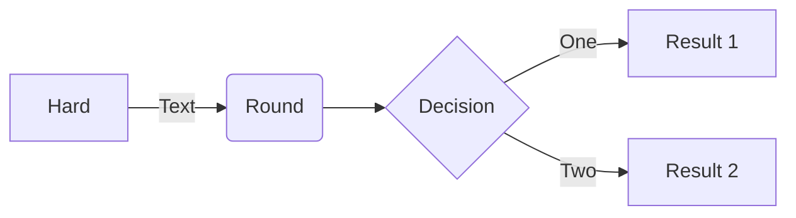

This page is using a 3rd-party server to automatically render plantuml images which allow github markdown to use text-based diagrams which are stored in a separate file. Note that as of February 2022, an even better solution is possible which is that mermaid text-based diagrams can be embedded directly into the markdown. So, this new approach eliminates the need for a separate file and for a 3rd-party server. Here is a very simple example:

